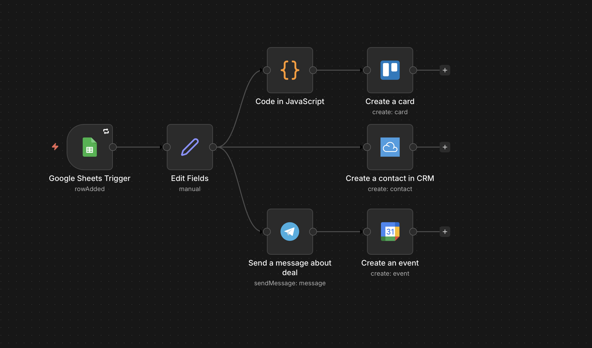

# Lead Processing Automation: Google Forms → Trello, Telegram & Agile CRM

Fully automated lead intake system built with n8n. Every Google Form submission triggers a multi-step workflow: Trello task creation, instant Telegram alert, Google Calendar reminder, and a new Agile CRM contact. Zero manual work, faster response times, and smoother client onboarding.

## Workflow Diagram

## Problem
Before automation, the team had to:
- Copy data manually to spreadsheets
- Create Trello tasks by hand
- Send team notifications
- Add calendar reminders
- Create Agile CRM contacts manually

This process was slow, error-prone, and led to missed tasks.

## Solution
An end-to-end n8n workflow that automatically:
- Normalizes Google Form data
- Creates Trello cards with proper labels
- Sends Telegram notifications to the team
- Creates Google Calendar events for follow-ups
- Adds new contacts to Agile CRM with lead source tagging

## Key Features
- Instant trigger on new Google Form submission
- Data normalization for consistent fields
- Multi-system automation: Trello, Telegram, Google Calendar, Agile CRM
- Zero manual intervention
- Fully scalable for high lead volumes

## Tech Stack
- n8n – workflow automation & orchestration
- Google Forms & Google Sheets – lead capture
- Trello API – task management
- Telegram Bot – real-time team notifications
- Google Calendar API – follow-up reminders
- Agile CRM API – lead storage and tracking
- JavaScript (n8n Code node) – custom data transformation

## Files
- `/workflow` – n8n workflow export (JSON)
- `/docs` – setup, security, integration documentation
- `/samples` – example data for testing and previews
- `/CASE_STUDY.md` – business case and results
- `/WORKFLOW_OVERVIEW.md` – detailed technical description of the automation logic

## Supported Use Cases
- Lead capture automation
- CRM onboarding
- Multi-channel notifications
- Agile workflow management

